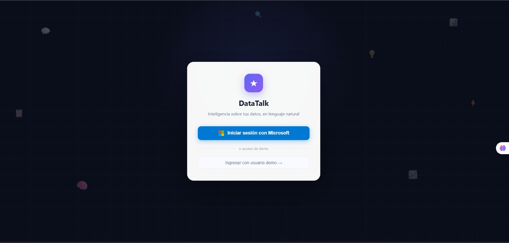

# DataTalk 🧠

**Microsoft Innovation Challenge 2025 — Agente de ingeniería analítica Text-to-SQL**

Convierte preguntas en lenguaje natural en consultas SQL validadas, las ejecuta contra un lake de datos y explica los resultados en lenguaje empresarial claro.

---

## ¿Qué hace?

1. **Sube un Excel o CSV** → se limpia automáticamente y se registra en DuckDB
2. **Pregunta en lenguaje natural** → el agente genera SQL
3. **Revisa y aprueba el SQL** antes de ejecutarlo (human-in-the-loop)
4. **Recibe los resultados** explicados en lenguaje empresarial
5. **Audit log** de cada consulta para trazabilidad completa

---

## Arquitectura

```
Usuario → FastAPI → Orquestador
                      ├── Schema Agent   (inspecciona tablas DuckDB)
                      ├── SQL Agent      (GPT-4o → SQL validado)
                      ├── Anomaly Agent  (detección de caídas)
                      ├── Forecast Agent (predicción Prophet)
                      └── Notifier Agent (Teams + RBAC)

Datos: Excel/CSV → Limpieza Python → DuckDB (lake en memoria)
Producción: → Azure Synapse Analytics + ADLS
```

---

## Estructura del proyecto

```
datatalk/
├── frontend/                        # React + Vite (interfaz web)
│   ├── src/
│   │   ├── components/              # Componentes reutilizables
│   │   ├── pages/                   # Vistas principales
│   │   └── main.jsx                 # Entry point
│   ├── public/
│   ├── index.html
│   ├── vite.config.js
│   └── package.json
│
├── backend/                         # Python + FastAPI (API y agentes)
│   ├── agents/
│   │   ├── orchestrator.py          # Coordina todos los agentes
│   │   ├── schema_agent.py          # Inspecciona tablas DuckDB
│   │   ├── sql_agent.py             # Text-to-SQL con GPT-4o
│   │   ├── anomaly_agent.py         # Detección de anomalías
│   │   ├── forecast_agent.py        # Predicción de ventas
│   │   └── notifier_agent.py        # Alertas Teams + RBAC
│   ├── api/
│   │   ├── main.py                  # FastAPI app
│   │   └── routes/
│   │       ├── query.py             # POST /query/ask + /query/approve
│   │       ├── upload.py            # POST /upload/
│   │       ├── alerts.py            # GET /alerts/
│   │       └── auth.py              # POST /auth/login
│   ├── data/
│   │   ├── cleaner.py               # Limpieza ligera de Excel/CSV
│   │   ├── duck_engine.py           # Motor DuckDB
│   │   └── schema_inspector.py      # Contexto de schema para el LLM
│   ├── core/
│   │   ├── config.py                # Settings desde .env
│   │   ├── rbac.py                  # Control de acceso por rol
│   │   └── audit.py                 # Audit log (Responsible AI)
│   └── tests/
│       ├── test_cleaner.py
│       └── test_sql_agent.py
│
├── .env.example
├── docker-compose.yml
└── README.md
```

---

## Requisitos previos

- Python 3.11+
- Node.js 18+
- Docker y Docker Compose (opcional, para correr todo en contenedores)
- Credenciales de Azure OpenAI (ver `.env.example`)

---

## Inicio rápido

### Opción A — Con Docker (recomendado)

Desde la raíz del proyecto:

```bash
cp .env.example .env
# Editar .env con tus credenciales de Azure OpenAI

docker-compose up --build
```

- Frontend disponible en: `http://localhost:5173`
- API disponible en: `http://localhost:8000`
- Docs de la API en: `http://localhost:8000/docs`

---

### Opción B — Local (sin Docker)

#### 1. Clonar y configurar

```bash
git clone https://github.com/TU_ORG/datatalk.git
cd datatalk
cp .env.example .env
# Editar .env con tus credenciales de Azure OpenAI
```

#### 2. Backend — Python + FastAPI

```bash
cd backend
python -m venv .venv
source .venv/bin/activate   # Windows: .venv\Scripts\activate
pip install -r requirements.txt

uvicorn datatalk.api.main:app --reload
# API disponible en http://localhost:8000
# Docs en http://localhost:8000/docs
```

#### 3. Frontend — React + Vite

Abrir una nueva terminal desde la raíz del proyecto:

```bash
cd frontend
npm install
npm run dev
# Frontend disponible en http://localhost:5173
```

#### Build y preview del frontend

```bash
npm run build
npm run preview
```

#### 4. Correr tests (backend)

```bash
cd backend
pytest tests/ -v
```

---

## Flujo de uso (API)

```bash
# 1. Subir un Excel
curl -X POST http://localhost:8000/upload/ \
  -F "file=@ventas.xlsx"

# 2. Hacer una pregunta
curl -X POST http://localhost:8000/query/ask \
  -H "Content-Type: application/json" \
  -d '{"question": "¿Cuáles son las 3 sucursales con más ventas este mes?", "role": "admin"}'

# 3. Aprobar el SQL y ejecutar
curl -X POST http://localhost:8000/query/approve \
  -H "Content-Type: application/json" \
  -d '{"sql": "SELECT ...", "user_id": "admin@datatalk.com", "role": "admin", "question": "..."}'
```

---

## Screenshots

### Bot de Teams — Menú principal y comandos disponibles



> El bot de Teams muestra los comandos disponibles y los 5 tipos de análisis soportados: Ranking, Tendencia, Comparativa, Anomalía y Agregación.

---

### Bot de Teams — Listado de archivos disponibles


> El comando `/archivos` lista todos los archivos cargados en el sistema. El usuario puede activar cualquiera con `/usar <nombre>`.

---

### Bot de Teams — Revisión del SQL antes de ejecutar


> Antes de ejecutar cualquier consulta, el bot muestra el SQL generado y pide confirmación explícita al usuario: **Aprobar y ejecutar** o **Rechazar**. Esto es el Human-in-the-Loop en acción.

---

### Bot de Teams — Resultado con insight empresarial


> Tras la aprobación, el sistema ejecuta la consulta y devuelve: una explicación en lenguaje empresarial, la tabla de resultados, y el tipo de análisis clasificado.

---

## Diseño del frontend

- **React + Vite** con HMR para desarrollo rápido
- **Fluent UI React** — design system oficial de Microsoft
- Layout responsivo con sidebar adaptable según tamaño de pantalla
- Visualizaciones con **React Charts** integradas directamente en la interfaz
- Cards, badges y barras de progreso que reflejan el estado de cada consulta
- Diseño orientado a storytelling para la demo

---

## Criterios del hackathon

| Criterio | Implementación |
|---|---|
| **Performance 25%** | DuckDB en memoria, FastAPI async, respuestas en < 5s |
| **Innovation 25%** | Text-to-SQL contextual + lake en memoria + anomaly detection |
| **Azure Services 25%** | OpenAI GPT-4o, Entra ID, Monitor, App Service, Blob Storage |
| **Responsible AI 25%** | Audit log, RBAC, human-in-the-loop, nivel de confianza visible |

---

## Próximos pasos (Post-Hackathon)

- Conectores para PostgreSQL y Azure SQL Database
- Teams Bot completo con historial de conversación persistente
- Dashboard de analytics de preguntas frecuentes por organización
- Fine-tuning del modelo con terminología de cada industria vertical
- Migración completa a Azure Synapse + ADLS Gen2 como motor de producción
- Modo proactivo: el agente detecta anomalías y envía alertas sin que el usuario pregunte
- Integración con ERP (SAP, Dynamics)
- API pública para integradores

---

## Equipo UmsaBrAInstorm

**Leandro · Vivian · Edgar · Jordy · Henry**

Microsoft Innovation Challenge 2025
